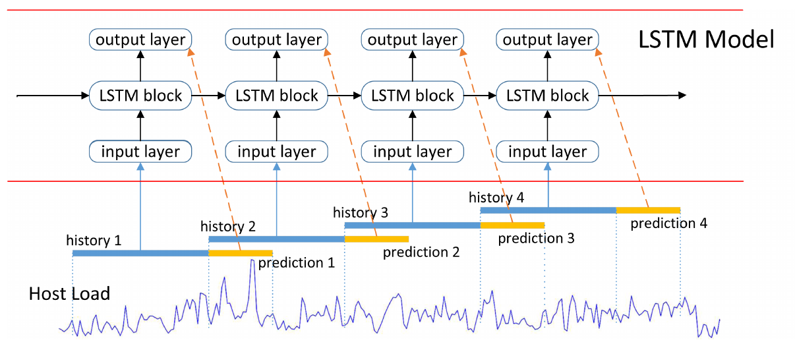
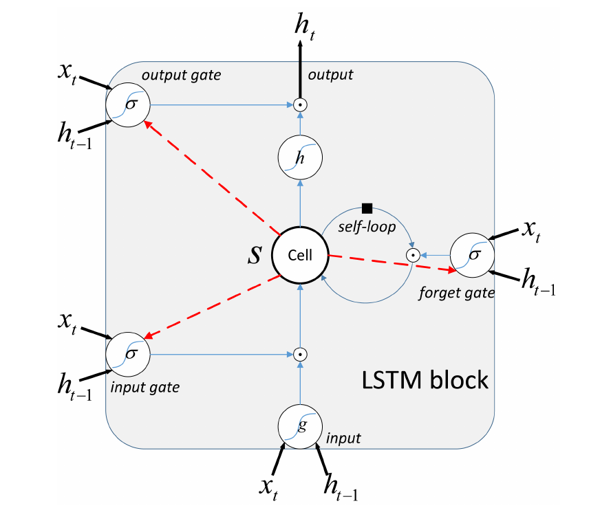

# Host-Load-Prediction-with-LSTM

> host load prediction with Long Short-Term Memory in cloud computing

- [Google cluster data](./Google_cluster_data) Preprocess the Google cluster data
- [Grid](./Grid) Preprocess the Grid dataset
- [autoencoder](./autoencoder) Apply the autoencoder to the host load data
- [tensorflow](./tensorflow) The main tensorflow code of realizing the project
- [draw](./draw) Drawing some comparing figures of the results

